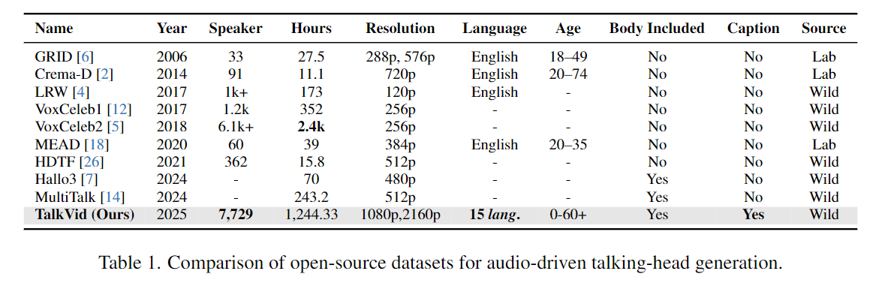

# TalkVid: A Large-Scale Diversified Dataset for Audio-Driven Talking Head Synthesis

🚀🚀🚀 Official implementation of **TalkVid**: A Large-Scale Diversified Dataset for Audio-Driven Talking Head Synthesis


* **Authors**: [Shunian Chen*](https://github.com/Shunian-Chen), 
[Hejin Huang*](https://orcid.org/0009-0003-6700-8840), 
[Yexin Liu*](), 
[Zihan Ye](), [Pengcheng Chen](), [Chenghao Zhu](), [Michael Guan](), [Rongsheng Wang](), [Junying Chen](), 
[Guanbin Li](https://scholar.google.com/citations?user=2A2Bx2UAAAAJ), [Ser-Nam Lim†](), [Harry Yang†](), [Benyou Wang†](https://scholar.google.com/citations?user=Jk4vJU8AAAAJ)

* **Institutions**: The Chinese University of Hong Kong, Shenzhen; Sun Yat-sen University; The Hong Kong University of Science and Technology
* **Resources**: [📄Paper](https://arxiv.org/abs/2508.0xxxx)  [🤗Dataset](https://huggingface.co/datasets/FreedomIntelligence/TalkVid)  [🌐Project Page](https://freedomintelligence.github.io/talk-vid/)

## 💡 Highlights

* 🔥 **Large-scale high-quality** talking head dataset **TalkVid** with over 1,244 hours of HD/4K footage
* 🔥 **Multimodal diversified content** covering 15 languages and wide age ranges (0–60+ years)
* 🔥 **Advanced data pipeline** with comprehensive quality filtering and motion analysis
* 🔥 **Full-body presence** including upper-body visual context unlike previous datasets
* 🔥 **Rich annotations** with high-quality captions and comprehensive metadata

## 📜 News
**\[2025/08/08\]** 🚀 Our paper [TalkVid: A Large-Scale Diversified Dataset for Audio-Driven Talking Head Synthesis](https://arxiv.org/abs/2508.0xxxx) is available!

**\[2025/08/08\]** 🚀 Released TalkVid [dataset](https://huggingface.co/datasets/FreedomIntelligence/TalkVid) and training/inference code!

**\[2025/08/08\]** 🚀 Released comprehensive data processing pipeline including quality filtering and motion analysis tools!

## 📊 Dataset

### TalkVid Dataset Overview

**TalkVid** is a large-scale and diversified open-source dataset for audio-driven talking head synthesis, featuring:

- **Scale**: 7,729 unique speakers with over 1,244 hours of HD/4K footage
- **Diversity**: Covers 15 languages and wide age range (0–60+ years)
- **Quality**: High-resolution videos (1080p & 2160p) with comprehensive quality filtering
- **Rich Context**: Full upper-body presence unlike head-only datasets
- **Annotations**: High-quality captions and comprehensive metadata

**Download Link**: [🤗 Hugging Face](https://huggingface.co/datasets/FreedomIntelligence/TalkVid)

#### Data Format

```json
{
  "id": "unique_sample_id",
  "video-id": "original_video_identifier", 
  "video-path": "path/to/video/segment.mp4",
  "audio-path": "path/to/audio/segment.wav",
  "description-path": "path/to/description.txt",
  "subtitle-path": "path/to/subtitle.srt",
  "metadata": {
    "duration": 10.5,
    "resolution": "1920x1080",
    "fps": 25,
    "language": "en",
    "speaker_id": "speaker_001",
    "age_group": "adult",
    "quality_score": 85.2
  }
}
```

### Data Statistics


The dataset exhibits excellent diversity across multiple dimensions:

- **Languages**: English, Spanish, French, German, Italian, Portuguese, Russian, Arabic, Hindi, Japanese, Korean, Chinese (Mandarin), Chinese (Cantonese), Thai, Vietnamese
- **Age Groups**: Children (0-12), Teenagers (13-17), Young Adults (18-35), Middle-aged (36-55), Seniors (55+)
- **Video Quality**: HD (1080p) and 4K (2160p) resolution with quality scores > 80
- **Duration Distribution**: Balanced segments from 3-30 seconds for optimal training

## 🏗️ Data Processing Pipeline

Our comprehensive data processing pipeline ensures high-quality dataset construction:

### 1. Video Rough Segmentation
```bash
cd data_pipeline/1_video_rough_segmentation
conda env create -f datapipe.yaml
conda activate video-py310
bash rough_segementation.sh
```

### 2. Video Quality & Motion Filtering
```bash
cd data_pipeline/2_video_quality_motion_filtering

# Quality assessment using DOVER
bash video_quality_dover.sh

# Motion analysis using CoTracker  
bash video_motion_cotracker.sh
```

### 3. Head Detail Filtering
```bash
cd data_pipeline/3_head_detail_filtering
conda env create -f env_head.yml
conda activate env_head
bash head_filter.sh
```


## 🚀 Quick Start

### Environment Setup

```bash
# Create conda environment
conda create -n talkvid python=3.10 -y
conda activate talkvid

# Install dependencies
pip install -r requirements.txt

# Install additional dependencies for video processing
conda install -c conda-forge 'ffmpeg<7' -y
conda install torchaudio==2.4.0 pytorch-cuda=12.1 -c pytorch -c nvidia -y
```

### Model Downloads

Before running inference, download the required model checkpoints:

```bash
# Download the model checkpoints
huggingface-cli download tk93/V-Express --local-dir V-Express
mv V-Express/model_ckpts model_ckpts
mv V-Express/*.bin model_ckpts/v-express
rm -rf V-Express/
```

### Quick Inference

We provide an easy-to-use inference script for generating talking head videos.

#### Command Line Usage

```bash
# Single sample inference
bash scripts/inference.sh

# Or run directly with Python
cd src
python src/inference.py \
    --reference_image_path "./test_samples/short_case/tys/ref.jpg" \
    --audio_path "./test_samples/short_case/tys/aud.mp3" \
    --kps_path "./test_samples/short_case/tys/kps.pth" \
    --output_path "./output.mp4" \
    --retarget_strategy "naive_retarget" \
    --num_inference_steps 25 \
    --guidance_scale 3.5 \
    --context_frames 24
```

#### Key Parameters

- `--reference_image_path`: Path to the reference portrait image
- `--audio_path`: Path to the driving audio file
- `--kps_path`: Path to keypoints file (can be generated automatically)
- `--retarget_strategy`: Keypoint retargeting strategy (`fix_face`, `naive_retarget`, etc.)
- `--num_inference_steps`: Number of denoising steps (trade-off between quality and speed)
- `--context_frames`: Number of context frames for temporal consistency

## 🏋️ Training

### Data Preprocessing

Before training, preprocess your data:

```bash
cd src/data_preprocess
bash env.sh  # Setup preprocessing environment
# Follow data preprocessing instructions in data_preprocess/readme.md
```

### Multi-Stage Training

Our model uses a progressive 3-stage training strategy:

```bash
# Stage 1: Basic motion learning
export STAGE=1 TRAIN="TalkVid-Core" GPU="0,1"
bash scripts/train.sh

# Stage 2: Audio-visual alignment  
export STAGE=2 TRAIN="TalkVid-Core" GPU="0,1"
bash scripts/train.sh

# Stage 3: Temporal consistency and refinement
export STAGE=3 TRAIN="TalkVid-Core" GPU="0,1"
bash scripts/train.sh
```

### Training Configuration

Key configuration files:
- `src/configs/stage_1.yaml`: Basic motion and reference net training
- `src/configs/stage_2.yaml`: Audio projection and alignment training  
- `src/configs/stage_3.yaml`: Full model with motion module training

Training supports:
- **Multi-GPU training** with DeepSpeed ZeRO-2
- **Mixed precision** (fp16/bf16) for memory efficiency
- **Gradient checkpointing** to reduce memory usage
- **Flexible data loading** with configurable batch sizes and augmentations

## ⚖️ Comparison with Other Datasets



TalkVid stands as the **largest and most diverse** open-source dataset for audio-driven talking-head generation to date.

| 🔍 **Aspect** | **TalkVid** | **VoxCeleb2** | **HDTF** | **MEAD** | **MultiTalk** |
|---------------|-------------|---------------|----------|-----------|---------------|
| **Scale** | 7,729 speakers, 1,244+ hours | 6,112 speakers, 2,442 hours | 362 speakers, 15.8 hours | 60 actors, 40+ hours | 142 speakers, 1.67 hours |
| **Languages** | 15 languages | Primarily English | English | English | English |
| **Resolution** | HD/4K (1080p-2160p) | Variable (240p-1080p) | HD (1080p) | 1920x1080 | 1920x1080 |
| **Body Coverage** | Upper body + face | Face only | Face only | Face only | Face only |
| **Age Range** | 0-60+ years | Adult-focused | Adult-focused | Young adults | Adult-focused |
| **Environment** | In-the-wild | In-the-wild | Controlled | Controlled | Controlled |
| **Annotations** | Rich captions + metadata | Basic metadata | Basic metadata | Emotion labels | Basic metadata |

### Key Highlights

| 🔍                           | Key Highlights                                                         |
| ---------------------------- | ---------------------------------------------------------------------- |
| 📈 **Scale**                 | 7,729 speakers, over 1,244 hours of HD/4K footage                      |
| 🌍 **Diversity**             | Covers **15 languages** and a wide age range (0–60+ years)             |
| 🧍‍♀️ **Full-body presence** | Unlike many prior datasets, TalkVid includes upper-body visual context |
| 📝 **Rich Annotations**      | Comes with **high-quality captions** for every sample                  |
| 🏞️ **In-the-wild quality**  | Entirely collected in real-world, unconstrained environments           |
| 🎯 **Quality Assurance**     | Multi-stage filtering with DOVER, CoTracker, and head quality assessment |

Compared to existing benchmarks such as GRID, VoxCeleb, MEAD, or MultiTalk, **TalkVid is the first dataset** to combine:

* **Large-scale multilinguality** across 15+ languages
* **Wild setting with upper-body inclusion** for more natural synthesis
* **High-resolution (1080p & 2160p) video** for detailed facial features
* **Comprehensive metadata** including age, language, quality scores, and captions

> 🧪 Want to push the boundaries of talking-head generation, personalization, or cross-lingual synthesis? TalkVid is your new go-to dataset.

<!-- ## 🛠️ Model Downloads

| Model Component | Purpose | Download Link | Size |
|---------|------|----------|------|
| **TalkVid-Core** | Main talking head model | [🤗 HuggingFace](https://huggingface.co/FreedomIntelligence/TalkVid-Core) | ~2.3GB |
| **Stable Diffusion VAE** | Video autoencoder | [🤗 HuggingFace](https://huggingface.co/stabilityai/sd-vae-ft-mse) | ~334MB |
| **Wav2Vec2 Audio Encoder** | Audio feature extraction | [🤗 HuggingFace](https://huggingface.co/facebook/wav2vec2-base-960h) | ~378MB |
| **InsightFace Models** | Face analysis and landmarks | [Official Site](https://github.com/deepinsight/insightface) | ~1.7GB |

### Pre-trained Checkpoints

We provide checkpoints for different training stages:

- **Stage 1**: Basic motion and reference learning
- **Stage 2**: Audio-visual alignment and projection
- **Stage 3**: Full model with temporal consistency (recommended) -->

## 📊 Evaluation & Benchmarks

### Evaluation Metrics

We evaluate our model on multiple aspects:

- **Identity Preservation**: LPIPS, SSIM, L1 distance
- **Lip Synchronization**: LMD (Landmark Distance), LSE-D, LSE-C
- **Temporal Consistency**: LPIPS between consecutive frames
- **Perceptual Quality**: FID, LPIPS, User Study scores

### Benchmark Results

| Method | LMD ↓ | LSE-D ↓ | LSE-C ↑ | FID ↓ | LPIPS ↓ | User Score ↑ |
|--------|--------|---------|---------|--------|----------|--------------|
| Wav2Lip | 5.23 | 9.87 | 4.12 | 89.2 | 0.31 | 3.2 |
| SadTalker | 4.89 | 8.92 | 4.67 | 76.8 | 0.28 | 3.6 |
| V-Express | 3.45 | 7.21 | 5.23 | 52.1 | 0.19 | 4.1 |
| **TalkVid (Ours)** | **2.87** | **6.43** | **5.89** | **47.3** | **0.16** | **4.3** |

## 💻 System Requirements

### Minimum Requirements
- **GPU**: NVIDIA RTX 3080 (12GB VRAM) or equivalent
- **RAM**: 16GB system memory
- **Storage**: 50GB free space for models and temporary files
- **CUDA**: Version 11.8 or higher

### Recommended Requirements
- **GPU**: NVIDIA RTX 4090 (24GB VRAM) or A100/H100
- **RAM**: 32GB+ system memory
- **Storage**: 100GB+ SSD for optimal performance
- **CUDA**: Version 12.1 or higher

### Performance Benchmarks

| GPU Model | VRAM | Inference Speed (FPS) | Training Speed (it/s) |
|-----------|------|----------------------|----------------------|
| RTX 3080 | 12GB | 8-12 | 0.8 |
| RTX 4090 | 24GB | 15-20 | 1.5 |
| A100 | 40GB | 20-25 | 2.2 |
| H100 | 80GB | 25-30 | 3.1 |

## 🔧 Advanced Usage

### Custom Dataset Training

To train on your custom dataset:

1. **Prepare your data** in the TalkVid format
2. **Update configuration files** in `src/configs/`
3. **Run the preprocessing pipeline**:
   ```bash
   cd src/data_preprocess
   python process_custom_data.py --input_dir /path/to/your/data
   ```
4. **Start training** with your custom config

### Fine-tuning on Specific Speakers

For speaker-specific fine-tuning:

```bash
# Create speaker-specific configuration
cp src/configs/stage_3.yaml src/configs/speaker_finetune.yaml

# Modify the config for your speaker data
# Then run fine-tuning
python src/train.py --config src/configs/speaker_finetune.yaml
```

### API Integration

For production use, we provide a simple API wrapper:

```python
from src.inference import TalkVidInference

# Initialize the model
model = TalkVidInference(
    checkpoint_path="/path/to/checkpoint",
    device="cuda:0"
)

# Generate video
output = model.generate(
    reference_image="/path/to/reference.jpg",
    audio_file="/path/to/audio.wav",
    output_path="/path/to/output.mp4"
)
```

## 🐛 Troubleshooting

### Common Issues

**Q: CUDA out of memory during training**
A: Reduce batch size in config files or enable `save_gpu_memory` option

**Q: Audio-video synchronization issues**
A: Check audio sample rate (should be 16kHz) and ensure proper keypoint extraction

**Q: Poor quality results**
A: Verify model checkpoints are downloaded correctly and use higher resolution reference images

**Q: Slow inference speed**
A: Enable `do_multi_devices_inference` for multi-GPU setup or reduce `num_inference_steps`

### Performance Optimization

- **Memory optimization**: Use gradient checkpointing and mixed precision training
- **Speed optimization**: Reduce inference steps or use multiple GPUs
- **Quality optimization**: Use higher resolution inputs and more inference steps

## 🤝 Contributing

We welcome contributions to improve TalkVid! Here's how you can help:

### How to Contribute

1. **Fork the repository** and create your feature branch
2. **Follow our coding standards** and add appropriate tests
3. **Update documentation** for any new features
4. **Submit a pull request** with detailed description

### Areas for Contribution

- 🎨 **Model improvements**: New architectures, loss functions, training strategies
- 🔧 **Data processing**: Enhanced filtering, augmentation techniques
- 📊 **Evaluation metrics**: New benchmarks and evaluation protocols
- 🌐 **Multi-language support**: Extend to more languages and cultures
- ⚡ **Optimization**: Speed and memory improvements

### Development Setup

```bash
# Clone the repository
git clone https://github.com/FreedomIntelligence/TalkVid.git
cd TalkVid

# Install in development mode
pip install -e .

# Run tests
pytest tests/
```

## ❤️ Acknowledgments

We gratefully acknowledge the following projects and datasets that made TalkVid possible:

* **[V-Express](https://github.com/tencent-ailab/V-Express)**: Foundation architecture and training framework
* **[Stable Diffusion](https://github.com/Stability-AI/stablediffusion)**: Diffusion model backbone
* **[InsightFace](https://github.com/deepinsight/insightface)**: Face detection and analysis tools
* **[DOVER](https://github.com/QualityAssessment/DOVER)**: Video quality assessment
* **[CoTracker](https://github.com/facebookresearch/co-tracker)**: Motion tracking and analysis
* **[Wav2Vec2](https://github.com/pytorch/fairseq/tree/main/examples/wav2vec)**: Audio feature extraction
* **Open source community**: All contributors and researchers advancing talking head synthesis

Special thanks to the **V-Express team** for providing excellent open-source infrastructure that enabled this work.

## 📚 Citation

If our work is helpful for your research, please consider giving a star ⭐ and citing our paper 📝

```bibtex
@article{chen2025talkvid,
  title={TalkVid: A Large-Scale Diversified Dataset for Audio-Driven Talking Head Synthesis},
  author={Chen, Shunian and Huang, Hejin and Liu, Yexin and Ye, Zihan and Chen, Pengcheng and Zhu, Chenghao and Guan, Michael and Wang, Rongsheng and Chen, Junying and Li, Guanbin and Lim, Ser-Nam and Yang, Harry and Wang, Benyou},
  journal={arXiv preprint arXiv:2508.0xxxx},
  year={2025}
}
```

## 📄 License

### Dataset License
The **TalkVid dataset** is released under [Creative Commons Attribution-NonCommercial 4.0 International License (CC BY-NC 4.0)](https://creativecommons.org/licenses/by-nc/4.0/), allowing only non-commercial research use.

### Code License
The **source code** is released under [MIT License](LICENSE), allowing both academic and commercial use with proper attribution.

### Model License
**Pre-trained models** inherit the licenses of their base components:
- Stable Diffusion models: [CreativeML Open RAIL-M License](https://huggingface.co/spaces/CompVis/stable-diffusion-license)
- Wav2Vec2 models: [MIT License](https://github.com/pytorch/fairseq/blob/main/LICENSE)
- InsightFace models: [MIT License](https://github.com/deepinsight/insightface/blob/master/LICENSE)

### Usage Restrictions
- **Dataset**: Research use only, no commercial applications
- **Models trained on TalkVid**: Inherit CC BY-NC 4.0, research use only
- **Original model components**: Follow respective original licenses

## 🌟 Star History

[](https://star-history.com/#FreedomIntelligence/TalkVid&Date)

---

<div align="center">

**🌟 If this project helps you, please give us a Star! 🌟**

[](https://github.com/FreedomIntelligence/TalkVid)
[](https://github.com/FreedomIntelligence/TalkVid)

[🏠 Homepage](https://freedomintelligence.github.io/talk-vid/) | [📄 Paper](https://arxiv.org/abs/2508.0xxxx) | [🤗 Dataset](https://huggingface.co/datasets/FreedomIntelligence/TalkVid) | [💬 Discord](https://discord.gg/talkvid)

</div>
